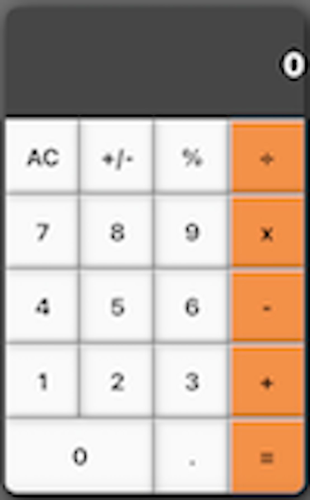

# Math Magicians Project (Module 4)

<!--
HOW TO USE:
This is an example of how you may give instructions on setting up your project locally.

Modify this file to match your project and remove sections that don't apply.

REQUIRED SECTIONS:
- Table of Contents
- About the Project
  - Built With
  - Live Demo
- Getting Started
- Authors
- Future Features
- Contributing
- Show your support
- Acknowledgements
- License

OPTIONAL SECTIONS:
- FAQ

After you're finished please remove all the comments and instructions!
-->

  <!-- You are encouraged to replace this logo with your own! Otherwise you can also remove it. -->
  
   

  <h3><b>Math Magicians Project</b></h3>

<!-- TABLE OF CONTENTS -->

# 📗 Table of Contents

- [📖 About the Project](#about-project)
  - [🛠 Built With](#built-with)
    - [Tech Stack](#tech-stack)
    - [Key Features](#key-features)
  - [🚀 Live Demo](#live-demo)
- [💻 Getting Started](#getting-started)
  - [Setup](#setup)
  - [Prerequisites](#prerequisites)
  - [Install](#install)
  - [Usage](#usage)
  - [Run tests](#run-tests)
  - [Deployment](#triangular_flag_on_post-deployment)
- [👥 Authors](#authors)
- [🔭 Future Features](#future-features)
- [🤝 Contributing](#contributing)
- [⭐️ Show your support](#support)
- [🙏 Acknowledgements](#acknowledgements)
- [❓ FAQ (OPTIONAL)](#faq)
- [📝 License](#license)

<!-- PROJECT DESCRIPTION -->

# 📖 [math-magicians] 

> Describe your project in 1 or 2 sentences.

**[math-magicians]** is a website for all fans of mathematics. It is a Single Page App (SPA) that allows users to:
    - [] Make simple calculations.
    - [] Read a random math-related quote.

## 🛠 Built With 

### Tech Stack 

  
Client

  <ul>
    <li><a href="https://reactjs.org/">React.js</a></li>
    <li><a href="https://html.com/">Html5</a></li>
    <li><a href="hhttps://www.w3schools.com/css/">CSS3</a></li>
    <li>JS</li>
    <li>ESLint</li>
    <li>StyleLints</li>
    <li>GitFlow</li>
    <li><a href="https://www.javascript.com/">ES6</a></li>
    <li>Webpack</li>
    <li>Jest</li>
  </ul>

  
Server

  <ul>
    <li><a href="#">N/A</a></li>
  </ul>

Database

  <ul>
    <li><a href="#">N/A</a></li>
  </ul>

<!-- Features -->

### Key Features 

- **[Dynamically]**
- **[Git-flow]**
- **[Good-HTML-JS-and-CSS-practices]**
- **[ES6-modules]**
- **[react-Jest-tests]**
- **[react-Webpack]**

(<a href="#readme-top">back to top</a>)

<!-- LIVE DEMO -->

## 🚀 Live Demo 

> Add a link to your deployed project.

- [Live Demo Link]()

(<a href="#readme-top">back to top</a>)

<!-- GETTING STARTED -->

## 💻 Getting Started 

To get a local copy up and running, follow these steps.

### Prerequisites

In order to run this project you need:

- A computer with node.js.
- Internet access.

### Setup

In order to run this project you need: clone this repo : [git@github.com:MMGGYY66/math-magicians.git]

### Install

After cloning the repo you need to install de dependencies.
- Run this command in the project folder:
 <code>npm install</code>

### Usage

To run the project, execute the following command:

- Builds the app for production to the build folder. It correctly bundles React in production mode and optimizes the build for the best performance. run:
 <code>npm run build</code>

 - Runs the app in the development mode. Open http://localhost:3000 to view it in the browser: run
 <code>npm start</code>

### Run tests

To run tests, run the following command:
 <code>npm test</code>

### Deployment

You can deploy this project using:

(<a href="#readme-top">back to top</a>)

<!-- AUTHORS -->

## 👥 Authors 

> Mention all of the collaborators of this project.

👤 **Mohamed Gamil Eldimardash**

- GitHub: [@github](https://github.com/MMGGYY66)
- LinkedIn: [LinkedIn](https://www.linkedin.com/in/mohamed-eldimardash-0023a3b5/)
- Twitter: [twitter](https://twitter.com/MOHAMEDELDIMARd)
- Facebook: [facebook](https://www.facebook.com/MOHAMED.ELDIMARDASH/)

(<a href="#readme-top">back to top</a>)

<!-- FUTURE FEATURES -->

## 🔭 Future Features 

- [ ] **[Create a directory called components.]**
- [ ] **[Inside components, create a new Calculator.js file.]**
- [ ] **[In Calculator.js, create a React component that matches given design]**

(<a href="#readme-top">back to top</a>)

<!-- CONTRIBUTING -->

## 🤝 Contributing 

Contributions, issues, and feature requests are welcome!

Feel free to check the [issues page](https://github.com/MMGGYY66/math-magicians/issues).

(<a href="#readme-top">back to top</a>)

<!-- SUPPORT -->

## ⭐️ Show your support 

If you like this project take the time to give a star, follow me and a feedback, we will appreciate it.

(<a href="#readme-top">back to top</a>)

<!-- ACKNOWLEDGEMENTS -->

## 🙏 Acknowledgments 

I would like to thank Microverse for giving me the chance to improve my coding.

(<a href="#readme-top">back to top</a>)

<!-- FAQ (optional) -->

## ❓ FAQ (OPTIONAL) 
- **What is this for?**

  - This is the first react.js project to practice working with react.js.

- **Can i copy this project?**

  - Your welcome, copy this project and let us know if you have any questions.

(<a href="#readme-top">back to top</a>)

<!-- LICENSE -->

## 📝 License 

This project is [MIT](./LICENSE) licensed.

(<a href="#readme-top">back to top</a>)

